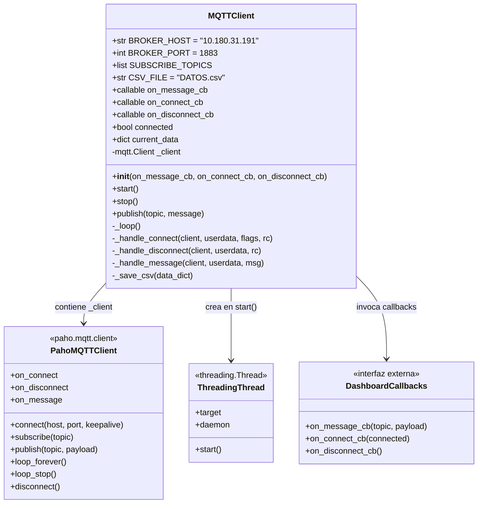
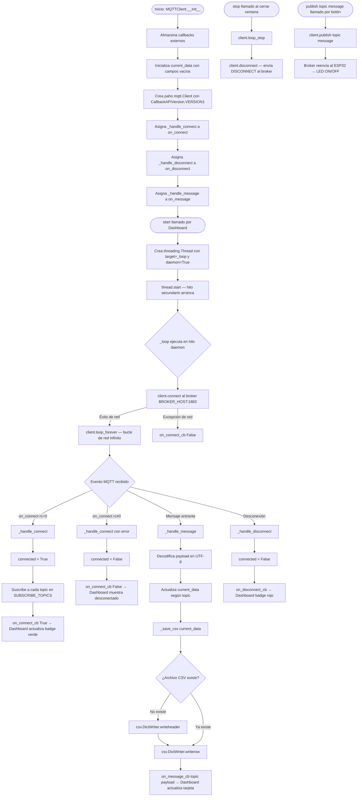
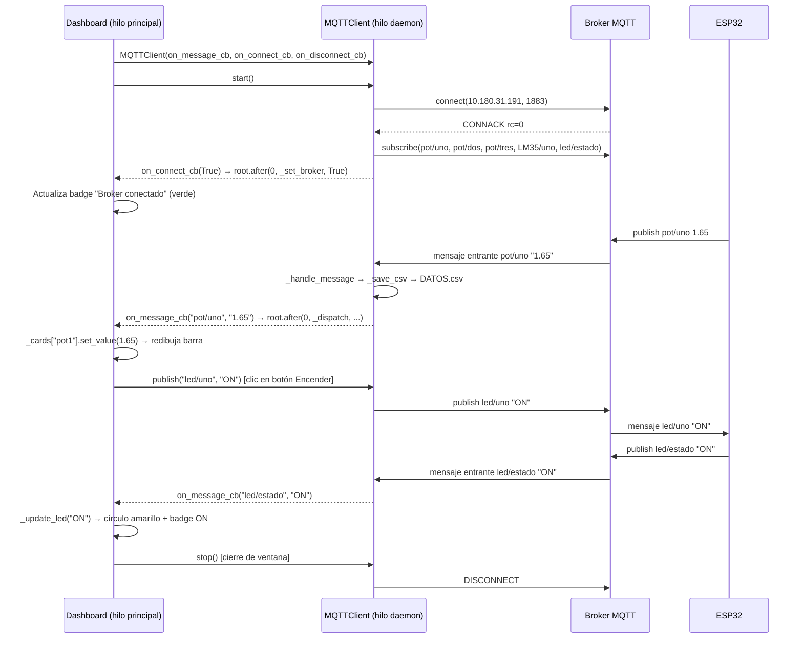

# Documentación de Librerías y Diagrama de Clases

## Archivos analizados
- `dashboard_tkinter.py` — Interfaz gráfica del dashboard ESP32/MQTT
- `mqtt_client.py` — Cliente MQTT que gestiona la conexión, mensajes y registro CSV

---

## 1. Librerías Utilizadas

### 1.1 `tkinter` (estándar de Python)

**Descripción:**
`tkinter` es la librería estándar de Python para crear interfaces gráficas de usuario (GUI). Está basada en el toolkit **Tk** (originalmente escrito en Tcl/Tk). Permite crear ventanas, botones, etiquetas, lienzos de dibujo, frames y otros componentes visuales de forma sencilla y multiplataforma (Windows, macOS, Linux).

**Importación en el proyecto:**
```python
import tkinter as tk
```

Se importa con el alias `tk` para acceder a todos sus componentes con el prefijo `tk.`.

---

### 1.2 `datetime` (estándar de Python)

**Descripción:**
`datetime` es el módulo estándar de Python para trabajar con fechas y horas. Provee la clase `datetime` que representa un instante en el tiempo (fecha + hora) y métodos para obtener la hora actual y formatearla como cadena de texto.

**Importación en el proyecto:**
```python
from datetime import datetime   # en dashboard_tkinter.py
from datetime import datetime   # en mqtt_client.py
```

Se importa directamente la clase `datetime` del módulo, para usarla sin prefijo.

---

### 1.3 `paho-mqtt` (`paho.mqtt.client`)

**Descripción:**
`paho-mqtt` es la librería cliente MQTT para Python mantenida por la Eclipse Foundation. Implementa el protocolo **MQTT (Message Queuing Telemetry Transport)**, un protocolo ligero de publicación/suscripción diseñado para dispositivos IoT y redes con ancho de banda limitado. Permite conectarse a un broker MQTT, suscribirse a topics, recibir mensajes y publicar mensajes.

**Importación en el proyecto:**
```python
import paho.mqtt.client as mqtt   # en mqtt_client.py
```

Se importa el módulo `client` dentro del paquete `paho.mqtt` con el alias `mqtt`.

---

### 1.4 `csv` (estándar de Python)

**Descripción:**
`csv` es el módulo estándar de Python para leer y escribir archivos en formato CSV (Comma-Separated Values). Proporciona escritores y lectores que manejan automáticamente los delimitadores, comillas y saltos de línea del formato CSV.

**Importación en el proyecto:**
```python
import csv   # en mqtt_client.py
```

---

### 1.5 `os` (estándar de Python)

**Descripción:**
`os` es el módulo estándar de Python que proporciona una interfaz con el sistema operativo. Permite verificar la existencia de archivos y directorios, manipular rutas, y otras operaciones del sistema de archivos de forma independiente al sistema operativo.

**Importación en el proyecto:**
```python
import os   # en mqtt_client.py
```

---

### 1.6 `threading` (estándar de Python)

**Descripción:**
`threading` es el módulo estándar de Python para ejecutar código en hilos (threads) de ejecución paralelos dentro del mismo proceso. Permite que tareas bloqueantes (como esperar mensajes de red) corran en segundo plano sin congelar la interfaz gráfica.

**Importación en el proyecto:**
```python
import threading   # en mqtt_client.py
```

---

## 2. Descripción Detallada de Cada Función de Librería

### 2.1 Funciones de `tkinter`

#### `tk.Tk()`
**Qué es:** Constructor de la ventana raíz de la aplicación.
**Cuándo se llama:**
```python
root = tk.Tk()   # en __main__ de dashboard_tkinter.py
```
**Qué hace:** Crea e inicializa la ventana principal del sistema operativo. Solo debe existir **una instancia** de `tk.Tk()` por aplicación. Internamente inicializa el intérprete Tcl/Tk y crea el widget raíz sobre el que se construyen todos los demás elementos. El objeto `root` se pasa al constructor de `Dashboard` para que este lo gestione.

---

#### `tk.Frame()`
**Qué es:** Widget contenedor rectangular invisible.
**Cuándo se llama:** En múltiples lugares como `_build_header`, `_build_cards`, `_build_led_section` y `_build_footer`.

```python
header = tk.Frame(self.root, bg=BG)
grid   = tk.Frame(self.root, bg=BG)
sec    = tk.Frame(self.root, bg=CARD_BG, highlightbackground=BORDER, highlightthickness=1)
```
**Qué hace:** Crea un rectángulo que actúa como contenedor para agrupar y organizar otros widgets. El parámetro `bg` establece el color de fondo, `highlightbackground` define el color del borde y `highlightthickness` el grosor del mismo. Los frames se usan para estructurar la interfaz en secciones lógicas (encabezado, tarjetas, sección LED, pie de página).

---

#### `tk.Label()`
**Qué es:** Widget que muestra texto o imágenes estáticas.
**Cuándo se llama:** Extensamente en `_build_header`, `_build_cards` (dentro de `SensorCard.__init__`), `_build_led_section` y `_build_footer`.

```python
tk.Label(self, text=label.upper(), bg=CARD_BG, fg=DIM, font=("Segoe UI", 7, "bold"), anchor="w")
self._val_lbl = tk.Label(self, text="—", bg=CARD_BG, fg=color, font=("Segoe UI", 26, "bold"), anchor="w")
```
**Qué hace:** Renderiza texto en pantalla. Los parámetros más relevantes son:
- `text`: cadena de texto a mostrar.
- `bg` / `fg`: color de fondo y de primer plano (texto).
- `font`: tupla `(familia, tamaño, estilo)` que define la tipografía.
- `anchor`: alineación del texto dentro del widget (`"w"` = izquierda).

Los `Label` que guardan referencia (como `self._val_lbl`) se actualizan dinámicamente con `.config(text=...)` cuando llegan nuevos datos MQTT.

---

#### `tk.Canvas()`
**Qué es:** Widget de dibujo vectorial de baja nivel.
**Cuándo se llama:**
```python
self._bar = tk.Canvas(self, bg=CARD_BG, height=8, highlightthickness=0)  # barra de progreso
self._dot = tk.Canvas(inner, width=10, height=10, bg=CARD_BG, highlightthickness=0)  # punto de estado
self._led_cv = tk.Canvas(inner, width=60, height=60, bg=CARD_BG, highlightthickness=0)  # círculo LED
```
**Qué hace:** Crea un área de dibujo 2D donde se pueden colocar formas geométricas (rectángulos, óvalos, líneas, texto). Se usa en lugar de widgets estándar cuando se necesita **control total del color y la forma**. El parámetro `highlightthickness=0` elimina el borde de enfoque que Tk añade por defecto.

---

#### `tk.Button()`
**Qué es:** Widget de botón interactivo.
**Cuándo se llama:**
```python
tk.Button(btns, text="Encender", bg=GREEN, fg=BG,
          font=("Segoe UI", 10, "bold"), padx=20, pady=8,
          relief="flat", cursor="hand2",
          command=lambda: self.mqtt.publish("led/uno", "ON"))

tk.Button(btns, text="Apagar", bg=RED_C, fg="white",
          command=lambda: self.mqtt.publish("led/uno", "OFF"))
```
**Qué hace:** Crea un botón que el usuario puede presionar. El parámetro `command` es la función que se ejecuta al hacer clic. En este caso, los botones llaman a `self.mqtt.publish(...)` para enviar un mensaje MQTT al ESP32 y encender o apagar el LED. `relief="flat"` elimina el efecto 3D del borde, `cursor="hand2"` cambia el cursor al pasar sobre el botón.

---

#### `.pack()`
**Qué es:** Método de geometry manager que organiza widgets en filas o columnas.
**Cuándo se llama:** En prácticamente todos los widgets del dashboard.

```python
header.pack(fill="x", padx=24, pady=(20, 0))
self._val_lbl.pack(fill="x")
self._bar.pack(fill="x")
```
**Qué hace:** Coloca el widget dentro de su contenedor padre usando el algoritmo de empaquetamiento. `fill="x"` hace que el widget se expanda horizontalmente para llenar el ancho disponible. `padx` y `pady` añaden espacio exterior en los ejes horizontal y vertical respectivamente.

---

#### `.grid()`
**Qué es:** Método de geometry manager que organiza widgets en una cuadrícula.
**Cuándo se llama:**
```python
card.grid(row=0, column=col_idx, sticky="nsew", padx=(0 if col_idx == 0 else 10, 0))
```
**Qué hace:** Coloca el widget en una celda específica de una cuadrícula (tabla). `row` y `column` definen la posición, `sticky="nsew"` hace que el widget se expanda en las cuatro direcciones (norte, sur, este, oeste) para llenar la celda completa.

---

#### `grid.columnconfigure()`
**Qué es:** Método para configurar columnas del geometry manager grid.
**Cuándo se llama:**
```python
grid.columnconfigure(col_idx, weight=1)
```
**Qué hace:** Asigna un peso relativo a la columna `col_idx`. Con `weight=1` todas las columnas tienen el mismo peso, por lo que se distribuyen el espacio disponible de forma equitativa. Esto hace que las 4 tarjetas de sensores tengan siempre el mismo ancho.

---

#### `.configure()` / `.config()`
**Qué es:** Método para modificar opciones de un widget ya creado.
**Cuándo se llama:**
```python
self.root.configure(bg=BG)                          # color de fondo de la ventana
self._val_lbl.config(text=f"{value:.{self._dec}f}") # actualizar valor numérico
self._broker_lbl.config(text="Broker conectado")    # cambiar texto del estado
self._led_badge.config(text="ON", bg="#332d00", fg=LED_ON)  # cambiar apariencia del badge
```
**Qué hace:** Permite cambiar en tiempo de ejecución cualquier propiedad del widget (texto, color, fuente, etc.) sin destruirlo y recrearlo. Es el mecanismo principal para actualizar la UI cuando llegan datos del broker MQTT.

---

#### `.geometry()`
**Qué es:** Método para establecer el tamaño y posición inicial de la ventana.
**Cuándo se llama:**
```python
self.root.geometry("980x520")
```
**Qué hace:** Fija el tamaño inicial de la ventana en 980 píxeles de ancho por 520 de alto. El formato es `"ANCHOxALTO"`. Opcionalmente puede incluir posición: `"980x520+100+50"`.

---

#### `.minsize()`
**Qué es:** Método para establecer el tamaño mínimo redimensionable de la ventana.
**Cuándo se llama:**
```python
self.root.minsize(760, 460)
```
**Qué hace:** Impide que el usuario redimensione la ventana por debajo de 760×460 píxeles, garantizando que los widgets siempre tengan espacio mínimo para ser visibles.

---

#### `.title()`
**Qué es:** Método para establecer el título de la ventana.
**Cuándo se llama:**
```python
self.root.title("ESP32 MQTT ")
```
**Qué hace:** Establece el texto que aparece en la barra de título de la ventana del sistema operativo.

---

#### `.after()`
**Qué es:** Método para programar la ejecución de una función en el hilo principal de Tk.
**Cuándo se llama:**
```python
self.root.after(0, self._set_broker, connected)
self.root.after(0, self._dispatch, topic, payload)
```
**Qué hace:** Encola una llamada a función para ejecutarse en el hilo principal de la GUI. El primer argumento `0` indica que se debe ejecutar lo antes posible (sin espera). **Esto es crítico**: las callbacks de paho-mqtt se ejecutan en un hilo secundario, y modificar widgets de tkinter desde un hilo diferente al principal puede causar corrupción. `.after()` traslada la actualización al hilo principal de forma segura.

---

#### `.protocol()`
**Qué es:** Método para asociar una función a un protocolo del gestor de ventanas.
**Cuándo se llama:**
```python
self.root.protocol("WM_DELETE_WINDOW", self._on_close)
```
**Qué hace:** Intercepta el evento del sistema operativo cuando el usuario presiona el botón de cerrar ventana (la "X"). En lugar de cerrar directamente, llama a `self._on_close`, que detiene el cliente MQTT limpiamente antes de destruir la ventana.

---

#### `.destroy()`
**Qué es:** Método para destruir un widget y todos sus hijos.
**Cuándo se llama:**
```python
self.root.destroy()   # en _on_close
```
**Qué hace:** Destruye la ventana raíz y termina el bucle principal de tkinter, cerrando la aplicación. Se llama después de `self.mqtt.stop()` para asegurar que la conexión MQTT se cierra antes de salir.

---

#### `.mainloop()`
**Qué es:** Método que inicia el bucle de eventos de tkinter.
**Cuándo se llama:**
```python
root.mainloop()   # en __main__
```
**Qué hace:** Bloquea la ejecución y entra en un bucle infinito que escucha eventos del sistema operativo (clics, pulsaciones de teclado, mensajes de la red, timers). Es el corazón de cualquier aplicación Tk. El bucle solo termina cuando la ventana se destruye con `.destroy()`.

---

#### `.bind()`
**Qué es:** Método para asociar un evento a una función callback.
**Cuándo se llama:**
```python
self._bar.bind("<Configure>", self._redraw)
```
**Qué hace:** Registra `self._redraw` como la función a llamar cuando el Canvas recibe el evento `<Configure>`, que se dispara cada vez que el widget cambia de tamaño. Esto permite que la barra de progreso se redibuje correctamente cuando el usuario redimensiona la ventana.

---

#### `canvas.create_oval()`
**Qué es:** Método del Canvas para dibujar una elipse o círculo.
**Cuándo se llama:**
```python
self._dot.create_oval(1, 1, 9, 9, fill=RED_C, outline="", tags="d")
self._led_cv.create_oval(4, 4, 56, 56, fill=LED_OFF, outline=BORDER, width=3, tags="led")
```
**Qué hace:** Dibuja una elipse definida por las coordenadas de su rectángulo borde `(x1, y1, x2, y2)`. `fill` es el color de relleno, `outline` el color del borde, `width` el grosor del borde, y `tags` es una etiqueta para referenciar la forma posteriormente con `itemconfig`.

---

#### `canvas.create_rectangle()`
**Qué es:** Método del Canvas para dibujar un rectángulo.
**Cuándo se llama:**
```python
self._bar.create_rectangle(0, 0, w, 8, fill=BAR_BG, outline="")   # fondo de la barra
self._bar.create_rectangle(0, 0, fill_w, 8, fill=self._color, outline="")  # relleno
```
**Qué hace:** Dibuja un rectángulo en el Canvas con las coordenadas `(x1, y1, x2, y2)`. Se usa para construir la barra de progreso: primero un rectángulo gris de fondo completo, luego uno coloreado que representa el porcentaje del valor.

---

#### `canvas.itemconfig()`
**Qué es:** Método del Canvas para modificar las opciones de un ítem ya dibujado.
**Cuándo se llama:**
```python
self._dot.itemconfig("d", fill=GREEN)           # cambiar color del punto de estado
self._led_cv.itemconfig("led", fill=LED_ON, outline="#e9b50b")  # encender LED visual
```
**Qué hace:** Modifica propiedades de una forma ya creada en el Canvas referenciada por su `tag`. Equivale a `.config()` pero para ítems del Canvas. Se usa para actualizar el color del círculo de estado del broker y el LED sin recrear las formas.

---

#### `canvas.delete()`
**Qué es:** Método del Canvas para eliminar ítems.
**Cuándo se llama:**
```python
self._bar.delete("all")   # en _redraw
```
**Qué hace:** Elimina todos los ítems dibujados en el Canvas (al usar `"all"`). Se llama antes de redibujar la barra de progreso para evitar acumular rectángulos superpuestos.

---

#### `canvas.winfo_width()`
**Qué es:** Método para obtener el ancho actual de un widget en píxeles.
**Cuándo se llama:**
```python
w = self._bar.winfo_width() or 1
```
**Qué hace:** Retorna el ancho en píxeles del Canvas en ese momento. El `or 1` previene división por cero si el widget aún no ha sido renderizado (ancho = 0). Se usa para calcular cuántos píxeles debe ocupar el relleno de la barra de progreso.

---

### 2.2 Funciones de `datetime`

#### `datetime.now()`
**Qué es:** Método de clase que retorna el instante actual.
**Cuándo se llama:**
```python
self.current_data["fecha"] = datetime.now().strftime("%H:%M:%S")  # en mqtt_client.py
self._ts_lbl.config(text=datetime.now().strftime("%H:%M:%S"))     # en dashboard_tkinter.py
```
**Qué hace:** Captura el instante exacto del reloj del sistema en ese momento y devuelve un objeto `datetime`. Se encadena inmediatamente con `.strftime()` para obtener la representación en texto.

---

#### `.strftime()`
**Qué es:** Método de instancia que formatea un objeto `datetime` como cadena de texto.
**Cuándo se llama:**
```python
datetime.now().strftime("%H:%M:%S")
```
**Qué hace:** Convierte el objeto `datetime` a una cadena de texto según el formato especificado. `%H` = hora en formato 24h, `%M` = minutos, `%S` = segundos. Resultado ejemplo: `"14:35:07"`. Esta cadena se muestra en el pie de página del dashboard como la hora de la última actualización.

---

### 2.3 Funciones de `paho.mqtt.client`

#### `mqtt.Client()`
**Qué es:** Constructor del cliente MQTT.
**Cuándo se llama:**
```python
self._client = mqtt.Client(mqtt.CallbackAPIVersion.VERSION1)
```
**Qué hace:** Crea una instancia del cliente MQTT. El parámetro `mqtt.CallbackAPIVersion.VERSION1` especifica explícitamente que se usará la API de callbacks de la versión 1 de paho-mqtt (compatible con versiones recientes del paquete que requieren este argumento). El cliente creado gestiona toda la comunicación TCP con el broker.

---

#### `client.on_connect`, `client.on_disconnect`, `client.on_message`
**Qué es:** Atributos para asignar funciones callback a eventos del cliente MQTT.
**Cuándo se usan:**
```python
self._client.on_connect    = self._handle_connect
self._client.on_disconnect = self._handle_disconnect
self._client.on_message    = self._handle_message
```
**Qué hace:** Registra las funciones que paho-mqtt llamará automáticamente cuando ocurran los eventos correspondientes:
- `on_connect`: se dispara al establecer (o fallar) la conexión con el broker.
- `on_disconnect`: se dispara cuando la conexión se pierde o se cierra.
- `on_message`: se dispara cada vez que llega un mensaje en un topic suscrito.

---

#### `client.connect()`
**Qué es:** Método para establecer la conexión TCP con el broker MQTT.
**Cuándo se llama:**
```python
self._client.connect(self.BROKER_HOST, self.BROKER_PORT, keepalive=60)
```
**Qué hace:** Inicia la conexión TCP al broker en la dirección `BROKER_HOST` (IP `10.180.31.191`) y puerto `BROKER_PORT` (1883). El parámetro `keepalive=60` indica que se enviará un paquete PINGREQ al broker cada 60 segundos si no hay actividad, para mantener la conexión viva. Esta llamada es **bloqueante** en cuanto al handshake MQTT, por eso se ejecuta dentro del hilo daemon.

---

#### `client.subscribe()`
**Qué es:** Método para suscribirse a un topic MQTT.
**Cuándo se llama:**
```python
for topic in self.SUBSCRIBE_TOPICS:
    client.subscribe(topic)
```
**Qué hace:** Envía una petición de suscripción al broker para el topic indicado. A partir de ese momento, cada vez que el broker reciba un mensaje en ese topic, lo reenviará al cliente y se disparará el callback `on_message`. Los topics suscritos son: `pot/uno`, `pot/dos`, `pot/tres`, `LM35/uno`, `led/estado`.

---

#### `client.publish()`
**Qué es:** Método para publicar un mensaje en un topic MQTT.
**Cuándo se llama:**
```python
self._client.publish(topic, message)   # en MQTTClient.publish()
# que es llamado desde los botones del dashboard:
lambda: self.mqtt.publish("led/uno", "ON")
lambda: self.mqtt.publish("led/uno", "OFF")
```
**Qué hace:** Envía un mensaje al broker MQTT en el topic especificado. El broker lo reenviará a todos los suscriptores de ese topic. En este caso, el ESP32 está suscrito a `led/uno` y al recibir `"ON"` o `"OFF"` enciende o apaga su LED físico.

---

#### `client.loop_forever()`
**Qué es:** Método que inicia el bucle de red del cliente MQTT de forma bloqueante.
**Cuándo se llama:**
```python
self._client.loop_forever()   # en _loop()
```
**Qué hace:** Entra en un bucle infinito que procesa los eventos de red del cliente MQTT: recibe mensajes entrantes, envía mensajes salientes y mantiene vivo el keep-alive. Se llama dentro del hilo daemon para que no bloquee la UI. Solo termina cuando se llama a `loop_stop()` o `disconnect()`.

---

#### `client.loop_stop()`
**Qué es:** Método para detener el bucle de red del cliente MQTT.
**Cuándo se llama:**
```python
self._client.loop_stop()   # en MQTTClient.stop()
```
**Qué hace:** Señala al bucle de `loop_forever()` que debe terminar. Permite una terminación limpia del hilo de red MQTT. Se llama antes de `disconnect()` en el proceso de cierre de la aplicación.

---

#### `client.disconnect()`
**Qué es:** Método para cerrar la conexión con el broker MQTT.
**Cuándo se llama:**
```python
self._client.disconnect()   # en MQTTClient.stop()
```
**Qué hace:** Envía un paquete DISCONNECT al broker (protocolo MQTT) y cierra la conexión TCP. Notifica al broker que la desconexión es intencional (a diferencia de una caída de red), lo que evita que el broker considere al cliente como desconectado abruptamente.

---

### 2.4 Funciones de `csv`

#### `csv.DictWriter()`
**Qué es:** Clase que escribe filas de diccionario en un archivo CSV.
**Cuándo se llama:**
```python
writer = csv.DictWriter(f, fieldnames=headers)
```
**Qué hace:** Crea un escritor CSV que mapea diccionarios Python a filas CSV usando las claves definidas en `fieldnames` como columnas. A diferencia del `csv.writer` simple, permite trabajar con diccionarios, haciendo el código más legible.

---

#### `writer.writeheader()`
**Qué es:** Método que escribe la fila de cabecera en el CSV.
**Cuándo se llama:**
```python
if not file_exists:
    writer.writeheader()
```
**Qué hace:** Escribe una primera fila con los nombres de las columnas (`fecha`, `Pot/uno`, `Pot/dos`, `Pot/tres`, `LM35/uno`, `Led/estado`). Solo se llama cuando el archivo CSV no existía previamente para evitar duplicar la cabecera.

---

#### `writer.writerow()`
**Qué es:** Método que escribe una fila de datos en el CSV.
**Cuándo se llama:**
```python
writer.writerow(data_dict)
```
**Qué hace:** Escribe una fila en el archivo CSV con los valores del diccionario `data_dict`, en el orden definido por `fieldnames`. Cada llamada a `_handle_message` genera una nueva fila con todos los datos actuales del sistema (hora + valores de los 3 potenciómetros + temperatura + estado del LED).

---

### 2.5 Funciones de `os`

#### `os.path.isfile()`
**Qué es:** Función que verifica si una ruta corresponde a un archivo existente.
**Cuándo se llama:**
```python
file_exists = os.path.isfile(self.CSV_FILE)
```
**Qué hace:** Retorna `True` si el archivo `DATOS.csv` ya existe en el sistema de archivos, o `False` si no existe. Este resultado determina si se debe escribir la cabecera del CSV. Se evalúa **antes** de abrir el archivo para evitar que la apertura en modo `"a"` (append) cree el archivo antes de verificar su existencia.

---

### 2.6 Funciones de `threading`

#### `threading.Thread()`
**Qué es:** Clase para crear un nuevo hilo de ejecución.
**Cuándo se llama:**
```python
thread = threading.Thread(target=self._loop, daemon=True)
```
**Qué hace:** Crea un nuevo hilo que ejecutará la función `self._loop` de forma concurrente. El parámetro `daemon=True` marca el hilo como demonio: cuando el proceso principal (la GUI) termina, este hilo se destruye automáticamente sin bloquear la salida del programa. `target` es la función que el hilo ejecutará.

---

#### `thread.start()`
**Qué es:** Método para iniciar la ejecución del hilo.
**Cuándo se llama:**
```python
thread.start()   # en MQTTClient.start()
```
**Qué hace:** Inicia el hilo de ejecución. A partir de este momento, `self._loop` se ejecuta en paralelo con la GUI de tkinter. Esto permite que el cliente MQTT escuche mensajes de red sin congelar la interfaz gráfica.

---

## 3. Diagrama de Flujo de Clases — `mqtt_client.py`

### 3.1 Diagrama de Clases



---

### 3.2 Diagrama de Flujo de Ejecución



---

### 3.3 Relación entre `dashboard_tkinter.py` y `mqtt_client.py`



---

## 4. Resumen de Dependencias

| Archivo | Librería | Propósito |
|---|---|---|
| `dashboard_tkinter.py` | `tkinter` | Ventana, widgets, event loop GUI |
| `dashboard_tkinter.py` | `datetime` | Timestamp de última actualización |
| `dashboard_tkinter.py` | `mqtt_client` | Cliente MQTT encapsulado |
| `mqtt_client.py` | `paho.mqtt.client` | Protocolo MQTT (conexión, suscripción, publicación) |
| `mqtt_client.py` | `threading` | Hilo daemon para no bloquear la GUI |
| `mqtt_client.py` | `datetime` | Timestamp en cada fila del CSV |
| `mqtt_client.py` | `csv` | Persistencia de datos en archivo CSV |
| `mqtt_client.py` | `os` | Verificar existencia del archivo CSV |
